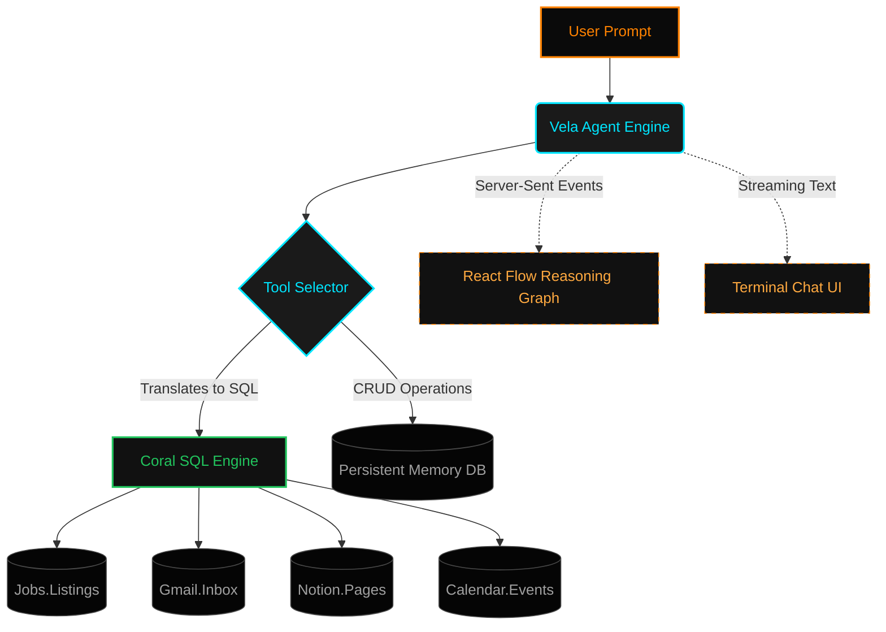

<table width="100%" border="0" cellspacing="0" cellpadding="0">
  <tr>
    <td width="110" align="left" valign="middle">
      
    </td>
    <td align="left" valign="middle">
      <h1>VELA // THE AI CAREER AGENT</h1>
      
<i>The autonomous career agent living in your terminal.</i>

    </td>
  </tr>
</table>

  
  
  
  
  
  

Vela is an intelligent, autonomous career agent built to streamline your job search and professional networking. Rather than managing spreadsheets and dozens of tabs, Vela connects directly to your data sources—like Gmail, Google Calendar, Notion, and Job boards—via **Coral SQL**. You simply tell Vela what you want to achieve, and it reasons through the necessary steps to fetch jobs, analyze your resume, and draft personalized outreach.

---

## System Architecture

Vela operates on a dynamic tool-calling loop. When a user provides a prompt, the intelligence engine determines the exact sequence of tools needed, generating SQL on-the-fly to extract data from disconnected sources using Coral SQL.

---

## Technical Stack

Vela was designed from the ground up for high performance, real-time visualization, and seamless data integration.

| Layer | Technology | Purpose |
| :--- | :--- | :--- |
| **Frontend UI** | `Next.js`, `React`, `TailwindCSS` | Delivers a high-performance, retro-terminal aesthetic interface. |
| **State & Graph** | `Zustand`, `React Flow`, `Dagre` | Manages global app state and auto-layouts the live reasoning graph. |
| **Backend API** | `FastAPI`, `Uvicorn`, `Python` | Powers the async tool loop and streams SSE data back to the client. |
| **Data Engine** | `Coral SQL` | Acts as the universal translation layer to query disconnected APIs via SQL. |
| **Persistence** | `SQLite` / `AioSQLite` | Stores user memories, preferences, and application tracking data locally. |
| **Intelligence** | `Gemini` / `Claude` | Powers the agentic reasoning, tool selection, and natural language synthesis. |

---

## Core Capabilities

- **Agentic Reasoning Engine**  
  Vela executes multiple tools in a single turn. For instance, asking to "draft an email for a backend role at Stripe" prompts the agent to search the job database, extract company details, and synthesize a personalized draft—all entirely autonomously.

- **Coral SQL Integration**  
  Data retrieval is exclusively powered by Coral SQL. Whether it's querying `jobs.listings` for new opportunities or `gmail.inbox` for recruiter responses, Vela leverages raw SQL to pull precise, high-performance insights across different APIs.

- **Live Reasoning Graph**  
  Built with `@xyflow/react`, the application provides full transparency. As the agent plans and executes, nodes populate dynamically. You literally watch the AI "think" and route data from Coral SQL directly to your screen in real time.

- **Resume Analysis & Optimization**  
  Upload your resume directly into the chat. Vela sanitizes the text, stores it securely, and cross-references it against live job descriptions to highlight keyword gaps and suggest targeted rewrites.

- **Persistent Memory & Tracking**  
  Vela remembers everything. Using the built-in `store_memory` and `track_application` tools, it logs your career goals, deadlines, and application statuses. This context is injected into every conversation, ensuring Vela acts as a true long-term companion.

---

## The Future of Vela

Vela was built to prove that job searching doesn't have to be a scattered, exhausting process. By combining autonomous agentic reasoning with the universal query power of Coral SQL, we've created a centralized command center for your career.

In future iterations, we plan to expand the connector ecosystem, allowing Vela to automate application submissions directly, auto-schedule interviews via direct calendar integration, and utilize voice-based interactions for hands-free interview preparation. 

*Stop managing spreadsheets. Start commanding your career.*
