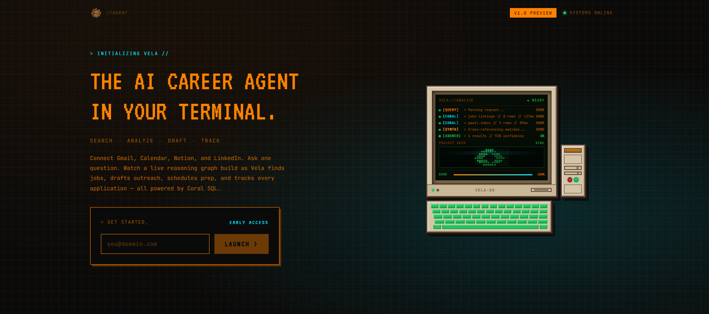
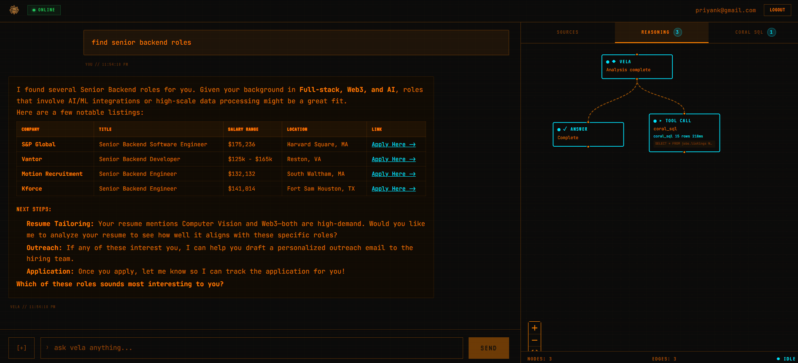
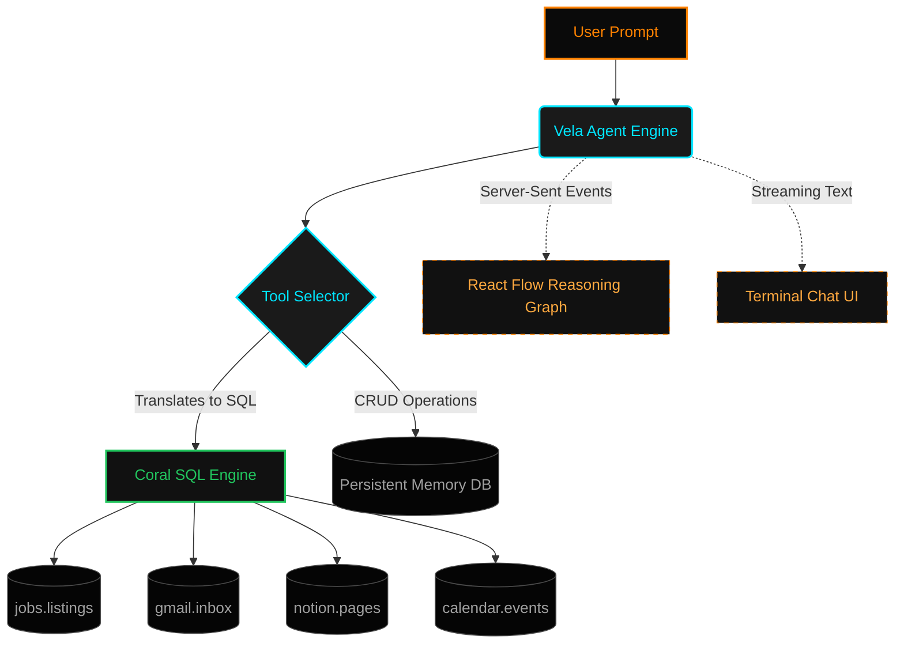
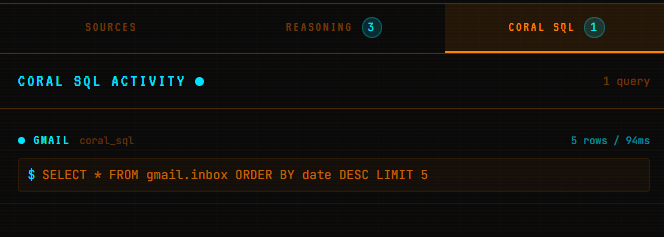
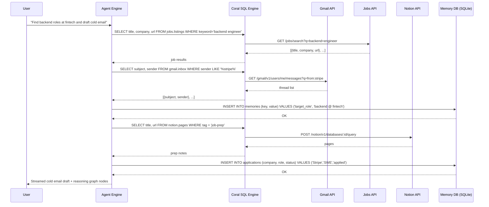
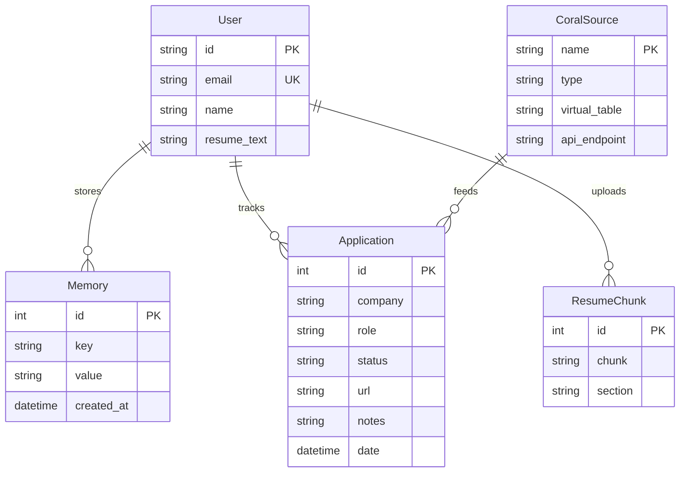

<table width="100%" border="0" cellspacing="0" cellpadding="0">
  <tr>
    <td>
      
    </td>
    <td width="110" align="right" valign="middle" style="padding-left:16px;">
      
    </td>
  </tr>
</table>

[](https://python.org)
[](https://nextjs.org)
[](https://fastapi.tiangolo.com)
[](https://github.com/withcoral/coral)
[](https://zustand-demo.pmnd.rs/)
[](https://reactflow.dev)
[](LICENSE)

VELA is an intelligent, autonomous career agent built to streamline your job search and professional networking. Rather than managing spreadsheets and dozens of browser tabs, VELA connects directly to your data sources — Gmail, Google Calendar, Notion, and job boards — via **Coral SQL**. You describe what you want to accomplish, and VELA reasons through the exact sequence of tools needed, fetches jobs, analyzes your resume, and drafts personalized outreach. All transparently, in real time.

---

## Overview

Job searching fails for three reasons: fragmented data, manual repetition, and zero memory across sessions. VELA is structured around solving all three. The agent maintains persistent memory of your career goals, application history, and resume context. It queries job data and your communications using raw Coral SQL — a universal interface over disconnected APIs — and surfaces gaps, drafts copy, and tracks every application automatically. A live reasoning graph built with React Flow renders the agent's decision tree in real time as it executes, so you always know exactly what it is doing and why.

---

## Landing Page



The landing page communicates VELA's core premise — a single terminal-native command center for your entire career pipeline. It introduces the Coral SQL data integration layer, the agentic reasoning loop, and the live visualization interface before prompting users to connect their data sources and run their first query.

## Dashboard



The dashboard is split into three panels. The left sidebar holds navigation and connector status — each integrated source (Gmail, Calendar, Notion, Jobs) shows live connection health. The center panel renders the terminal-style chat interface where every prompt and streamed agent response appears in sequence. The right panel hosts the React Flow reasoning graph, which populates nodes dynamically as the agent selects and executes tools, giving full transparency into every reasoning step.

---

## System Architecture

VELA operates on a dynamic tool-calling loop. When a user submits a prompt, the intelligence engine determines the exact sequence of tools required, generating Coral SQL on the fly to extract data from disconnected sources and writing results back to the persistent SQLite memory store.



**Request path.** Every prompt enters the FastAPI backend and is passed to the VELA agent engine along with the full conversation history and the current memory context injected from SQLite. The tool selector decides which tools to invoke, in which order, based on the prompt semantics. Each tool either translates its input into a Coral SQL query executed against a live data source, or performs a direct CRUD operation on the local memory database.

**Realtime path.** The FastAPI endpoint streams two parallel SSE channels back to the Next.js client: one for raw text tokens forming the chat response, and one for structured graph events. Each graph event carries a node type, label, and status — `pending`, `running`, or `done` — which the React Flow renderer uses to populate the reasoning graph incrementally without a page reload.

**Memory path.** On each tool execution, the `store_memory` tool writes structured records to the SQLite memory table — career goals, resume snippets, application records, and deadline alerts. Before each new agent call, the memory layer is queried and the top-k most relevant records are prepended to the system prompt as context, making VELA a true long-term career companion.

---

## Coral SQL — How Queries Hit Your Data

VELA uses Coral SQL as its universal data translation layer. Rather than building bespoke API clients for every integration, VELA writes plain SQL against virtual tables that Coral SQL maps to live API calls. Below is a full breakdown of every query pattern the agent executes.

### Live Query Flow



The diagram above shows a real agent turn: the user asks VELA to find backend roles and draft a recruiter email. The agent fires `search_jobs` via Coral SQL against `jobs.listings`, then pulls the recruiter's email thread from `gmail.inbox`, stores the application in the local SQLite memory, and synthesizes the outreach draft — all in a single reasoning pass, visible node-by-node in the reasoning graph.

### Query Sequence



### SQL Query Reference

| Tool | Query Executed | Data Source | When It Fires |
| ---- | -------------- | ----------- | ------------- |
| `search_jobs` | `SELECT title, company, location, url, description FROM jobs.listings WHERE keyword = ?` | Jobs board API | User asks to find open roles |
| `read_inbox` | `SELECT subject, sender, snippet, date FROM gmail.inbox WHERE unread = true LIMIT 20` | Gmail API | User asks about recruiter replies |
| `search_emails` | `SELECT subject, sender, body FROM gmail.inbox WHERE sender LIKE ? OR subject LIKE ?` | Gmail API | User searches for a specific recruiter or company |
| `get_calendar` | `SELECT title, start_time, end_time FROM calendar.events WHERE date >= TODAY()` | Google Calendar API | User asks about upcoming interviews |
| `get_notion_pages` | `SELECT title, url, content FROM notion.pages WHERE tag = ?` | Notion API | User pulls prep notes or saved resources |
| `store_memory` | `INSERT INTO memories (key, value, created_at) VALUES (?, ?, ?)` | SQLite (local) | Agent saves a goal, deadline, or preference |
| `retrieve_memory` | `SELECT key, value FROM memories WHERE key LIKE ? ORDER BY created_at DESC` | SQLite (local) | Agent injects context into the next turn |
| `track_application` | `INSERT INTO applications (company, role, status, date) VALUES (?, ?, ?, ?)` | SQLite (local) | User logs or agent detects a new application |
| `update_application` | `UPDATE applications SET status = ? WHERE company = ? AND role = ?` | SQLite (local) | User reports an interview or offer |
| `list_applications` | `SELECT company, role, status, date FROM applications ORDER BY date DESC` | SQLite (local) | User asks for a pipeline overview |
| `analyze_resume` | *(file parse + chunk store)* | Uploaded PDF | User uploads resume for gap analysis |

### SQLite Schema

```sql
-- Persistent memory store
CREATE TABLE IF NOT EXISTS memories (
    id         INTEGER  PRIMARY KEY AUTOINCREMENT,
    key        TEXT     NOT NULL,
    value      TEXT     NOT NULL,
    created_at DATETIME DEFAULT CURRENT_TIMESTAMP
);

-- Application pipeline tracker
CREATE TABLE IF NOT EXISTS applications (
    id         INTEGER  PRIMARY KEY AUTOINCREMENT,
    company    TEXT     NOT NULL,
    role       TEXT     NOT NULL,
    status     TEXT     DEFAULT 'applied', -- applied | screening | interview | offer | rejected
    url        TEXT,
    notes      TEXT,
    date       DATETIME DEFAULT CURRENT_TIMESTAMP
);

-- Resume store (sanitized text chunks)
CREATE TABLE IF NOT EXISTS resume_chunks (
    id      INTEGER PRIMARY KEY AUTOINCREMENT,
    chunk   TEXT    NOT NULL,
    section TEXT
);
```

---

## Data Model



---

## Core Capabilities

**Agentic Reasoning Engine.** VELA executes multiple tools in a single turn. Prompting it to "draft a cold email for a backend role at Stripe" causes it to search the job database for the listing, retrieve company context via Coral SQL, and synthesize a fully personalized draft — all autonomously and without manual orchestration.

**Coral SQL Integration.** Data retrieval is exclusively powered by Coral SQL. Whether querying `jobs.listings` for new opportunities or `gmail.inbox` for recruiter responses, VELA writes raw SQL against virtual tables that map one-to-one with live APIs, delivering precise, high-performance insight across disconnected sources in a single interface.

**Live Reasoning Graph.** Built with `@xyflow/react` and `Dagre` for automatic layout, the graph panel provides complete transparency. As the agent plans and executes, nodes populate dynamically. You watch the AI decide which tool to call next, see each Coral SQL query fire, and observe results arrive in real time — all before the final answer streams to the chat.

**Resume Analysis and Optimization.** Upload your resume directly into the chat. VELA sanitizes the text, stores it in chunked form in SQLite, and cross-references it against live job descriptions to highlight keyword gaps, missing skills, and targeted rewrite opportunities, ranked by relevance to each specific role.

**Persistent Memory and Tracking.** VELA remembers everything across sessions. Using the built-in `store_memory` and `track_application` tools, it logs career goals, application deadlines, interview dates, and pipeline status. This context is injected into every new conversation, ensuring VELA acts as a true long-term career companion rather than a stateless chatbot.

---

## Tech Stack

| Layer | Technology | Version | Purpose |
| ----- | ---------- | ------- | ------- |
| Frontend UI | Next.js + React | 14 | Retro-terminal aesthetic interface |
| Styling | TailwindCSS | 3 | Utility-first layout and theming |
| State | Zustand | 4 | Global app state management |
| Graph | React Flow + Dagre | 11 / 0.8 | Live agent reasoning visualization |
| Backend API | FastAPI + Uvicorn | 0.111 | Async tool loop and SSE streaming |
| Agent Runtime | Python | 3.11 | Tool orchestration and LLM calls |
| Data Engine | Coral SQL | latest | Universal SQL interface over APIs |
| Persistence | SQLite + AioSQLite | 3 | Local memory, applications, resume |
| Intelligence | Gemini / Claude | latest | Agentic reasoning and NL synthesis |
| Containerization | Docker Compose | 3.8 | Multi-service local orchestration |

---

## Project Structure

```
VELA/
├── frontend/
│   ├── public/
│   │   └── logo.png
│   └── src/
│       ├── app/
│       │   ├── page.tsx              # Landing page
│       │   ├── dashboard/
│       │   │   └── page.tsx          # Main chat + graph dashboard
│       │   └── layout.tsx
│       ├── components/
│       │   ├── ChatPanel.tsx         # Terminal-style chat UI
│       │   ├── ReasoningGraph.tsx    # React Flow reasoning visualizer
│       │   ├── ConnectorStatus.tsx   # Sidebar data source health
│       │   └── ResumeUpload.tsx      # PDF intake component
│       ├── store/
│       │   └── useAgentStore.ts      # Zustand global state
│       └── lib/
│           └── sse.ts                # SSE client utilities
├── backend/
│   └── app/
│       ├── main.py                   # FastAPI entrypoint + SSE router
│       ├── agent.py                  # Core agentic loop and tool dispatch
│       ├── tools.py                  # All tool definitions (Coral SQL + SQLite)
│       ├── memory.py                 # SQLite read/write helpers
│       ├── coral.py                  # Coral SQL query execution layer
│       ├── resume.py                 # PDF parse and chunk storage
│       └── schema.py                 # Pydantic request/response models
├── doc/
│   └── Images/
│       ├── logo-vela.png
│       ├── VELA Banner.png
│       ├── landing.png
│       ├── dashboard.png
│       └── query-flow.png
├── .env.example
├── .gitignore
├── docker-compose.yml
├── pyproject.toml
└── README.md
```

---

## Getting Started

### Prerequisites

Python 3.11 or later, Node.js 18 or later, and Docker (optional, for containerized setup). A Coral SQL API key and at least one connected data source are required for live queries.

### Clone and Install

```bash
git clone https://github.com/Priyank911/VELA.git
cd VELA
```

Install backend dependencies:

```bash
cd backend
pip install -e ".[dev]"
```

Install frontend dependencies:

```bash
cd frontend
npm install
```

### Environment

```bash
cp .env.example .env
```

| Variable | Description |
| -------- | ----------- |
| `CORAL_API_KEY` | API key for the Coral SQL engine |
| `GEMINI_API_KEY` | Gemini API key for the reasoning model |
| `ANTHROPIC_API_KEY` | Anthropic API key (Claude, optional fallback) |
| `GMAIL_CLIENT_ID` | OAuth client ID for Gmail connector |
| `GMAIL_CLIENT_SECRET` | OAuth client secret for Gmail connector |
| `NOTION_API_KEY` | Notion integration token |
| `GOOGLE_CALENDAR_CREDS` | Path to Calendar OAuth credentials JSON |
| `DATABASE_URL` | SQLite database path — defaults to `./vela.db` |

### Database Initialization

```bash
cd backend
python -c "from app.memory import init_db; import asyncio; asyncio.run(init_db())"
```

Creates the `memories`, `applications`, and `resume_chunks` tables in the local SQLite database.

### Development

```bash
# Terminal 1 — backend
cd backend
uvicorn app.main:app --reload --port 8000

# Terminal 2 — frontend
cd frontend
npm run dev
```

Frontend runs on port 3000. Backend runs on port 8000. SSE streams are served at `/api/agent/stream`.

### Docker

```bash
docker-compose up --build
```

Starts both services in a shared network. Frontend proxies API requests to the backend container automatically.

---

## API Reference

### Agent

| Method | Endpoint | Auth | Description |
| ------ | -------- | ---- | ----------- |
| `POST` | `/api/agent/stream` | None | Submit a prompt; returns SSE stream of text tokens and graph events |
| `GET` | `/api/agent/history` | None | Return the full conversation history for the session |
| `DELETE` | `/api/agent/history` | None | Clear conversation history and reset session memory |

### Memory

| Method | Endpoint | Auth | Description |
| ------ | -------- | ---- | ----------- |
| `GET` | `/api/memory` | None | List all stored memory records |
| `POST` | `/api/memory` | None | Write a key-value memory record directly |
| `DELETE` | `/api/memory/:key` | None | Delete a specific memory record |

### Applications

| Method | Endpoint | Auth | Description |
| ------ | -------- | ---- | ----------- |
| `GET` | `/api/applications` | None | List all tracked applications ordered by date |
| `POST` | `/api/applications` | None | Log a new application manually |
| `PUT` | `/api/applications/:id` | None | Update application status or notes |
| `DELETE` | `/api/applications/:id` | None | Remove an application record |

### Resume

| Method | Endpoint | Auth | Description |
| ------ | -------- | ---- | ----------- |
| `POST` | `/api/resume` | None | Upload and parse a PDF resume; stores chunks in SQLite |
| `GET` | `/api/resume` | None | Return the current stored resume chunks |

---

## SSE Event Schema

Events emitted on the `/api/agent/stream` endpoint carry a `type` field that the frontend uses to route updates to the correct panel.

| Event Type | Panel Target | Payload |
| ---------- | ------------ | ------- |
| `text_delta` | Chat panel | `{ delta: string }` |
| `tool_start` | Reasoning graph | `{ tool: string, input: object, node_id: string }` |
| `tool_end` | Reasoning graph | `{ node_id: string, output: object, status: "done" \| "error" }` |
| `sql_query` | Reasoning graph | `{ node_id: string, query: string, source: string }` |
| `message_end` | Chat panel | `{ full_text: string }` |

---

## The Future of VELA

VELA was built to prove that job searching does not have to be a scattered, exhausting process. By combining autonomous agentic reasoning with the universal query power of Coral SQL, it delivers a centralized command center for your career.

Planned iterations include expanding the connector ecosystem to support LinkedIn and Greenhouse, automating application submissions directly through Coral SQL write operations, auto-scheduling interviews via direct Calendar integration, and adding voice-based interaction for hands-free interview preparation.

*Stop managing spreadsheets. Start commanding your career.*

---
<div align="center">
  
  <br>
  <b>Built by</b>
  <a href="https://github.com/Priyank911">Priyank911</a>
  |
  <a href="https://github.com/Jay2219">Jay2219</a>
</div>
